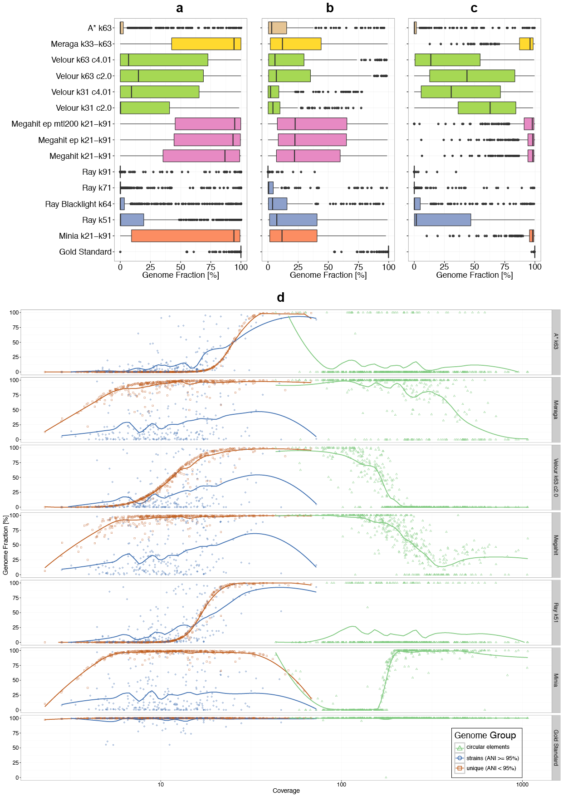
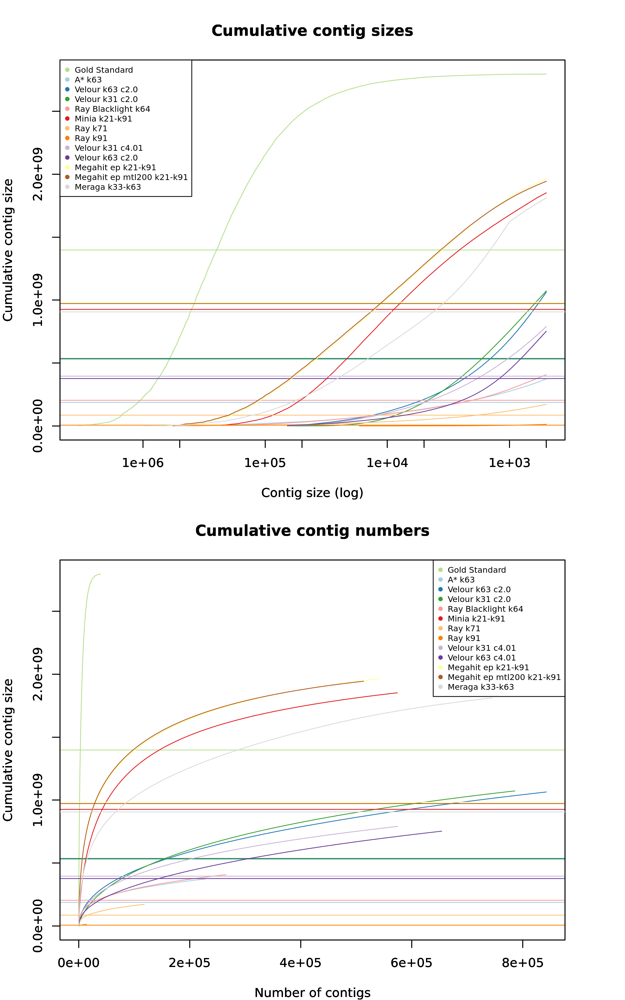

# Assemblies submitted for high complexity dataset

## Contents

The analysis is divided in three sections: 

1. Assemblers

2. Parallel Coordinates Plot

3. Genome Fraction Line Plot

4. Genome Fraction BoxPlot

5. Cumulative Contig Size Plots

## Assemblers

| Assembler      | Group   | 
|----------------|-----|
| Gold Standard  |  1  |
| Minia k21-k91  |  2  |
| Megahit k21-k91  |  5  |
| Megahit ep k21-k91  | 5 |
| Megahit ep mtl200  k21-k91  |  5   |
| Velour k31 c2.0  |    6   |
| Velour k31 c4.01 |    6   |
| Velour k63 c2.0  |    6   |
| Velour k63 c4.01 |    6   |
| Ray k51                |    4   |
| Ray k71 		|    4   |
| Ray k91                |    4   |
| Ray Blacklight k64    |    4   |
| Meraga k33-k63      |    8   |   
| A* k63	|    9   | 

## Parallel Coordinates Plot

**Supplementary Figure SA1.** Parallel coordinate plot showing performances of all assemblies for the high complexity data set. Vertical axes represent the combined key QUAST metrics for all reference genomes. Each assembly is represented by a colored line, labels are on the left. Metrics shown are number of contigs (contigs), total length of assembly (Total_length), number of misassemblies (misassemblies), length of unaligned contigs (Unaligned_length), fraction of genomes recovered (Genome_fraction), duplication ratio, mismatches, predicted genes and NA50. 

## Genome Fraction Line Plot

**Supplementary Figure SA2.** Genome recovery fraction versus genome sequencing depth (coverage) for the high complexity data set. Data were classified as unique genomes (ANI < 95%, brown color), genomes with related strains present (ANI >= 95%, blue color) and high copy circular elements (green color).

## Genome Fraction Box and Line Plot

**CAMI Assembly Main Figure.** Boxplots representing the fraction of reference genomes assembled by
each assembler for the high complexity data set. (a): all genomes, (b): genomes with
ANI >=95%, (c): genomes with ANI < 95%. Coloring indicates the results from the
same assembler incorporated in different pipelines or with other parameter settings.
(d): genome recovery fraction versus genome sequencing depth (coverage) for the
high complexity data set. Data were classified as unique genomes (ANI < 95%,
brown color), genomes with related strains present (ANI >= 95%, blue color) and high
copy circular elements (green color). The gold standard includes all genomic regions covered by at least one read in the metagenome dataset, therefore the genome fraction for low abundance genomes can be less than 100%.

## Cumulative Contig Size Plots

**Cumulative Contig Size Plots:** Plot shows cumulative contig size versus contig size/contig numbers.
Horizontal lines show the N50.
