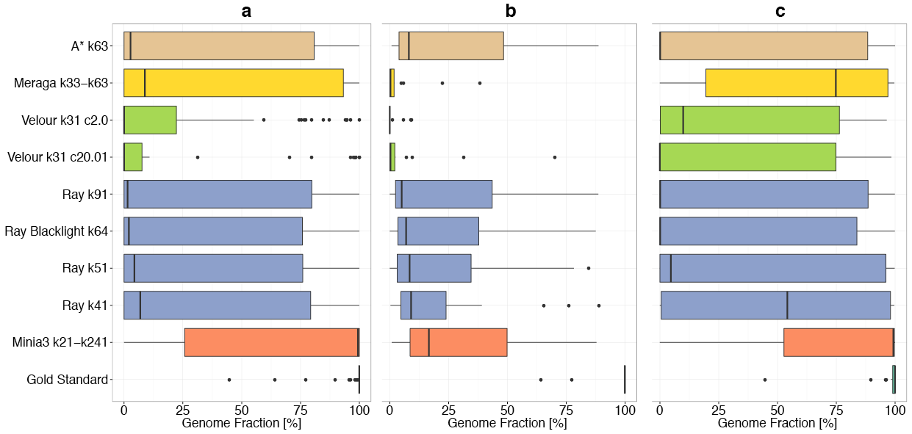
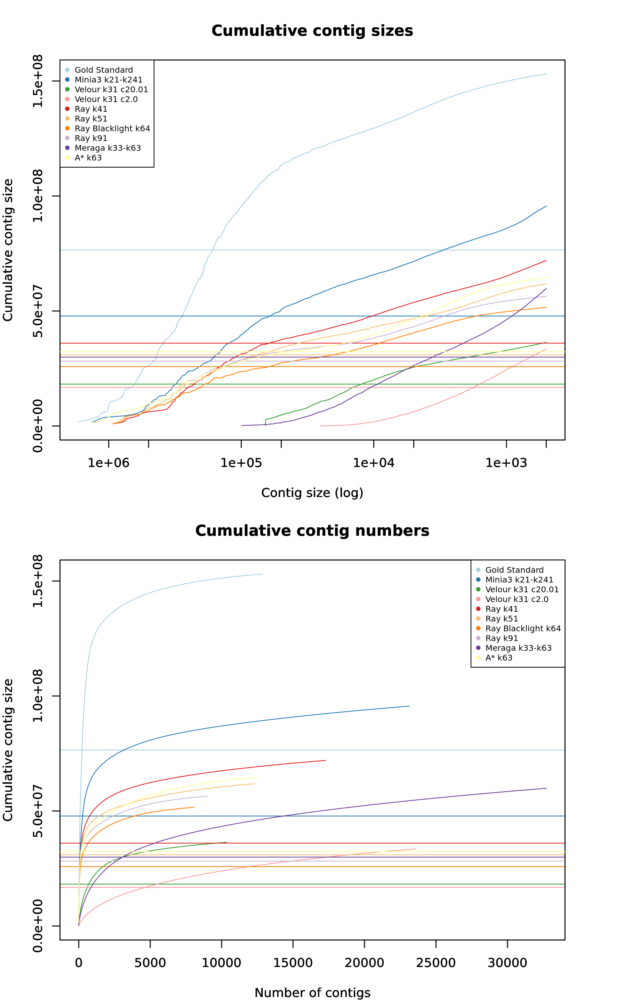

# Assemblies submitted for low complexity dataset

## Contents

The analysis is divided in three sections:

1. Assemblers

2. Parallel Coordinates Plot

3. Genome Fraction Line Plot

4. Genome Fraction BoxPlot

5. Cumulative Contig Size Plots

## Assemblers:

| Assembler       | Group |
|-----------------|-------|
| Gold Standard   | 1     |
| Minia3 k21-k241 | 3     | 
| Ray k51  | 4    |  
| Ray Blacklight k64 | 4  |  
| Ray k41  | 4   |    
| Ray k91 |  4  |  
| Velour k31 c20.01  | 5  |
| Velour k31 c2.0  | 5  | 
| Meraga k33-k63 |  6   |
| A* k63  |  7   |

## Parallel Coordinates Plot

## Genome Fraction Line Plot

## Genome Fraction BoxPlot

## Cumulative Contig Size Plots

**Cumulative Contig Size Plots:** Plot shows cumulative contig size versus contig size/contig numbers.
Horizontal lines show the N50.
