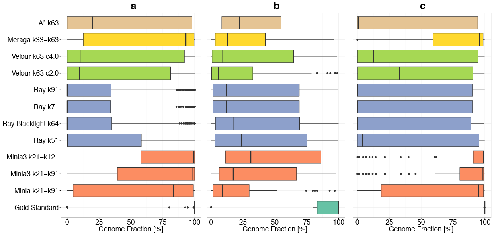
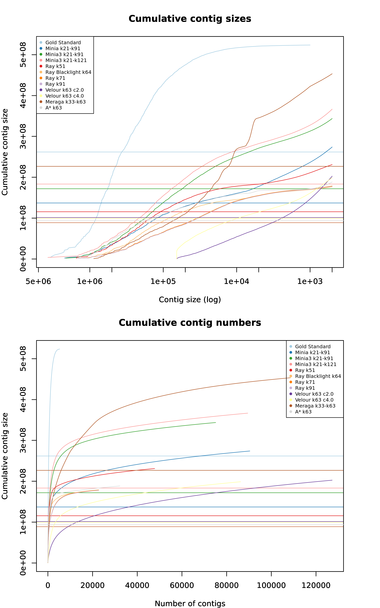

# Assemblies submitted for medium complexity dataset

## Contents

The analysis is divided in three sections:

1. Assemblers

2. Parallel Coordinates Plot

3. Genome Fraction Line Plot

4. Genome Fraction BoxPlot

5. Cumulative Contig Size Plots

## Assemblers

| Assembler | Group | 
|--------------------|--------|
| Gold_Standard_0    |  0     |
| A* k63 |  1   |
| Ray Blacklight k64 |  2   |  
| Ray k71 | 2  | 
| Ray k51  | 2  |
| Ray k91  | 2  |
| Minia3 k21-k91 |  4  | 
| Minia k21-k91 | 4 |  
| Minia3 k21-k121 |  4  |  
| Meraga k33-k63   |  7 |  
| Velour k63 c4.0   |  8 | 
| Velour k63 c2.0   |  8 | 

## Parallel Coordinates Plot

**Supplementary Figure SA4.** Parallel coordinate plot showing performances of all assemblies for the medium complexity data set. Vertical axes represent the combined key QUAST metrics for all reference genomes. Each assembly is represented by a colored line, labels are on the left. Metrics shown are number of contigs (contigs), total length of assembly (Total_length), number of misassemblies (misassemblies), length of unaligned contigs (Unaligned_length), fraction of genomes recovered (Genome_fraction), duplication ratio, mismatches, predicted genes and NA50. For a detailed description of metrics and results for the medium and low complexity data sets see supplemental methods.

## Genome Fraction Line Plot

**Supplementary Figure SA6.** Genome recovery fraction versus genome sequencing depth (coverage) for the medium complexity data set. Data were classified as unique genomes (ANI < 95%, brown color), genomes with related strains present (ANI >= 95%, blue color) and high copy circular elements (green color).

## Genome Fraction Box Plot

**Supplementary Figure SA5.** Boxplots representing the fraction of reference genomes assembled by each assembler for the medium complexity data set. (a) All genomes; (b) genomes with ANI >=95%; (c) genomes with ANI < 95%. Coloring indicates the results from the same assembler incorporated in different pipelines or with other parameter settings.

## Cumulative Contig Size Plots

**Cumulative Contig Size Plots:** Plot shows cumulative contig size versus contig size/contig numbers.
Horizontal lines show the N50.
