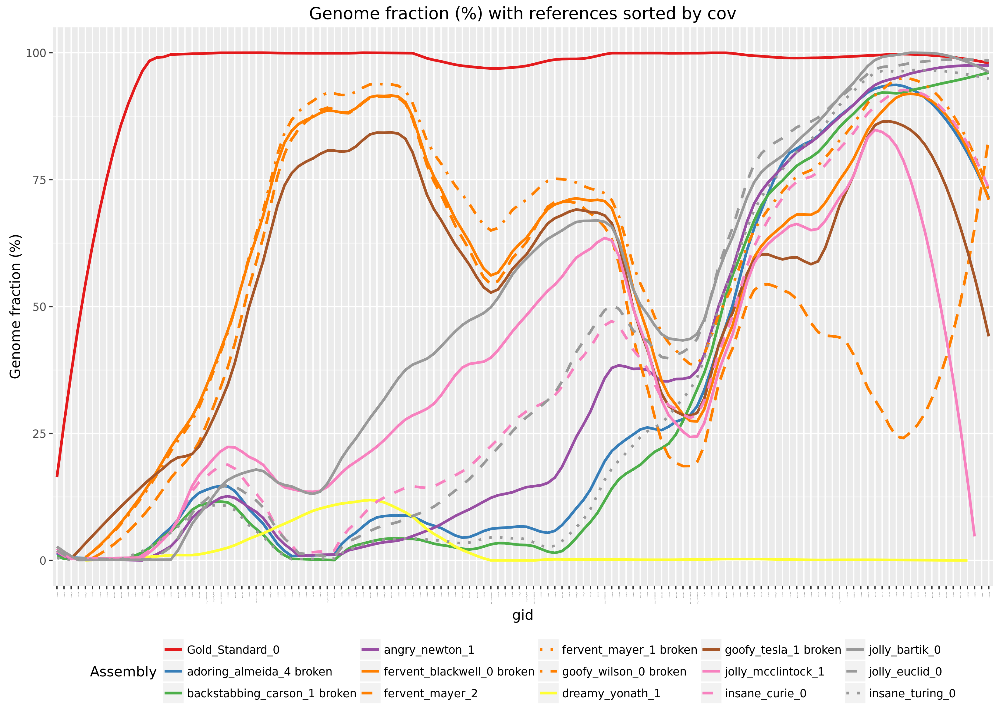

# Summary DRAFT

Before you continue reading this document, please take the following points into account:

  * **At present this draft is based on medium complexity dataset !!**

  * **This is just a draft, multiple points noted here must first be further examined**

### Assembler Summary:

| Assembler Anonymous | Group | Algorithms  | scaffolding | # Tools part of the pipeline (i.e. postprocessing tools) |
|--------------------|--------|--------|----------|-------|
| Gold_Standard_0    |  0     |   -    |    -     |   -   |
| adoring_almeida_4  |  1   |  De Bruijn,Bayesian model-based clustering  |  yes  |    2 |
| backstabbing_carson_1 |  2   |  De Bruijn    |  -  | 1 | 
| angry_newton_1  |  3  |  De Bruijn           |  -  | 2 |   
| fervent_blackwell_0  |  4  |  De Bruijn    | yes | 2 |
| fervent_mayer_1  |  4 |  De Bruijn  | yes | 6 |  
| fervent_mayer_2  | 4 |  De Bruijn  | yes | 6 |  
| goofy_wilson_0 |  4  |  De Bruijn  | yes | 6 |  
| dreamy_yonath_1 | 5  |  De Bruijn  | - | 2 |   
| goofy_tesla_1  |  7  |  De Bruijn | - | 2 |  
| insane_curie_0  | 8  | -  | - | - | 
| jolly_mcclintock_1   |  8 | - | - | - | 
| insane_turing_0 | 9  | De Bruijn | no | 1 | 
| jolly_bartik_0  | 9  | De Bruijn | no | 1 |
| jolly_euclid_0  | 9  | De Bruijn | no | 1 |

### Number of Contigs

**Metric:** 
Number of contigs is the total number of contigs in the assembly.

#### Statements

  * Each assembly starts with a low number of contigs. This is because in the start there is a very low coverage and thus no nearly no overlaps between reads.

  * When there is enough read overlaps number of contigs starts to rise. 

  * Coverage reaches a point where not more, but longer contigs can be build, so the line starts to decrease again. 

  * This peak is for each assembler different and depends on for example kmer parameter.

  * Just group 8 and 4 starts to rise again for references with higher coverage.

### Genome Fraction

**Metric:** 
Genome fraction (%) is the percentage of aligned bases in the reference. A base in the reference is aligned if there is at least one contig with at least one alignment to this base. Contigs from repetitive regions may map to multiple places, and thus may be counted multiple times.

#### Statements

  * All assemblers start at very low genome fraction because there is not enough data

  * Group 4 (orange) rises almost linear until nearly 100%. Other Assemblers have also a peak but with a lower Genome Fraction ( ~30% )

  * Unfulfilled Expectation: Genome fraction stays at 100% once enough coverage is available.

    * genome coverage for all assemblers drops

  * For the 30 genomes with highest coverage, genome coverage starts to rise again

  * With the exception of two assemblers of group four all assemblers genome coverage drops for the genomes with the highest coverage  
