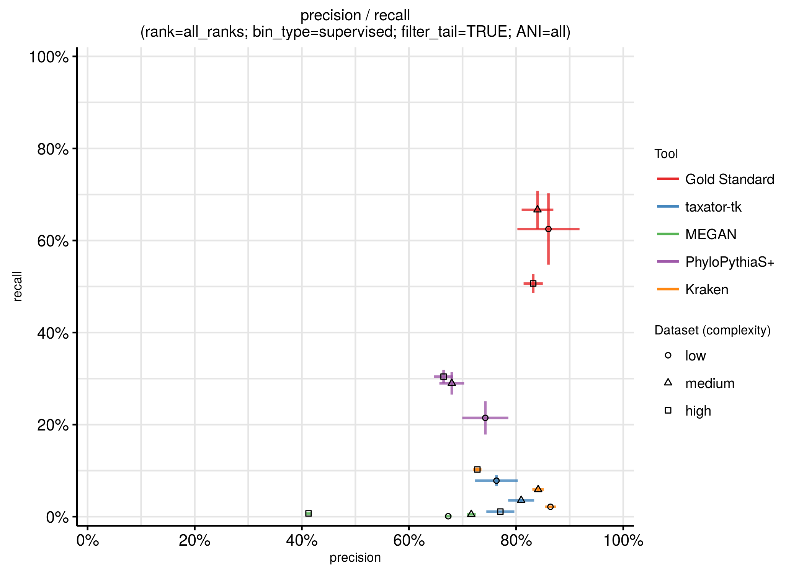
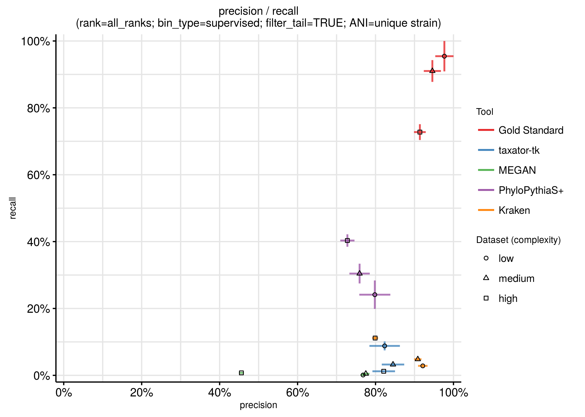
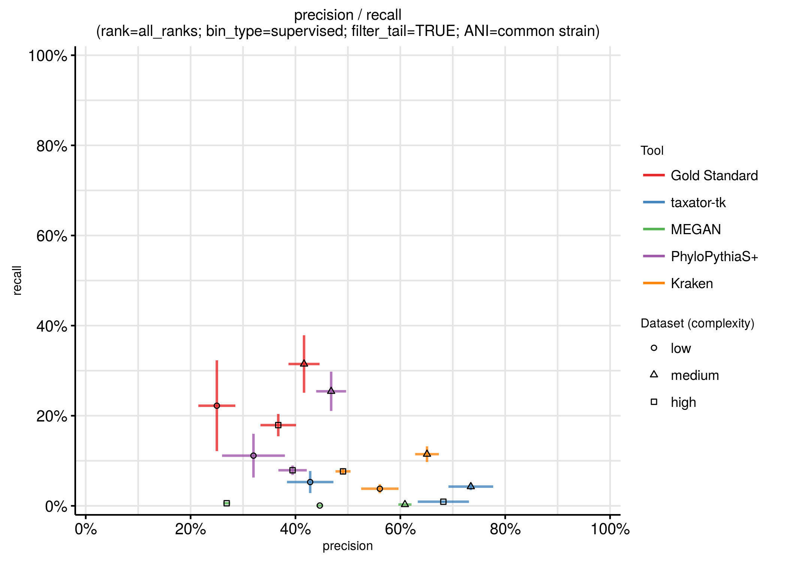
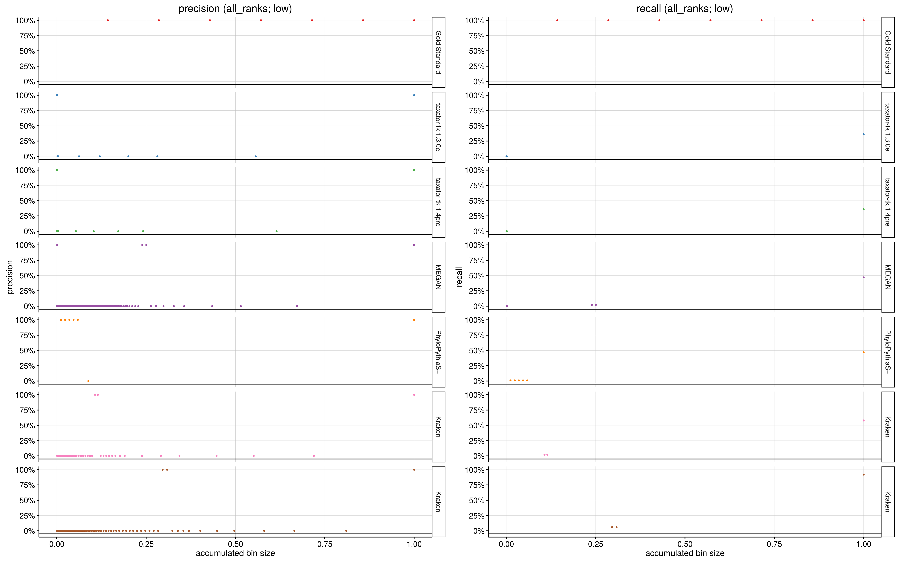
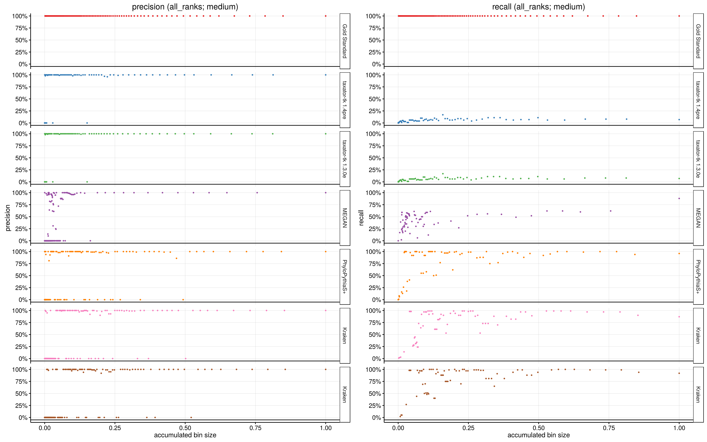
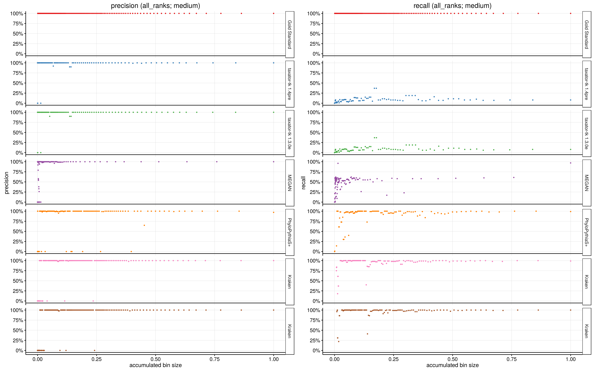
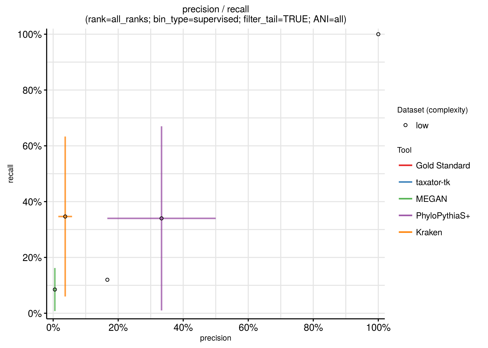
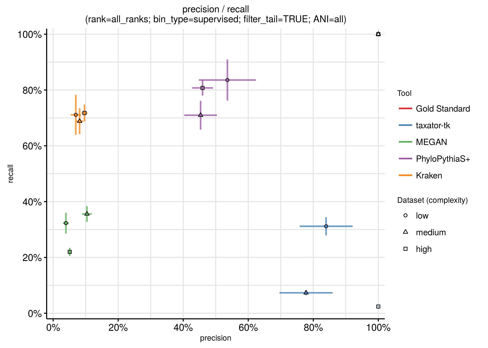
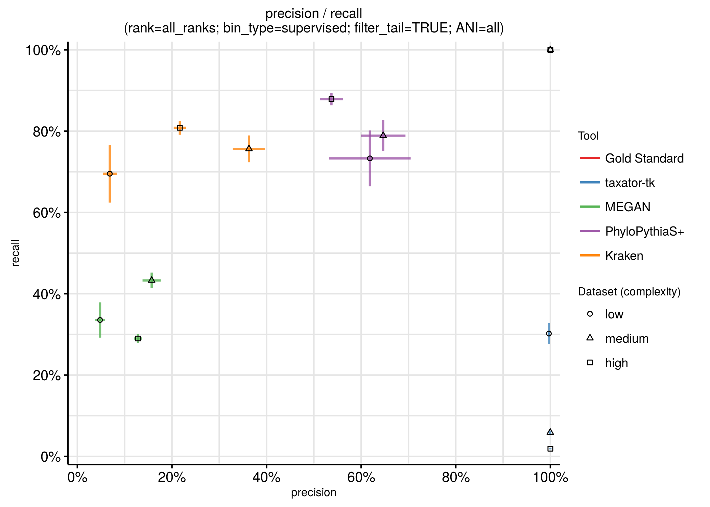
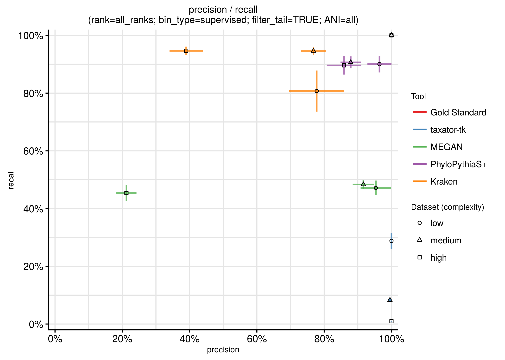

## Results of the binning challenge

Current metagenome assembly and scaffolding methods return mixtures of variable length fragments originating from individual genomes of a sequenced microbiome. Metagenome binning algorithms were thus devised to tackle the problem of grouping these according to their organismal origin. These  “bins”, or sets of assembled sequences or reads ideally group data from one of the individual strains present in the sequenced microbial community.  However, resolution to this level is not always possible, in which case bins representing taxa at higher taxonomic ranks are returned, e.g. species-, or family-level bins. Bin reconstruction allows subsequent genome and pangenome analyses of the individual community members. While binning methods group sequences into bins without assignment of taxonomic labels, taxonomic binning methods group sequences into bins with a taxonomic label attached. Within CAMI, use of the NCBI taxonomy as a reference taxonomy allowed determination of taxonomic bins at all encoded taxonomic ranks, from species to root-level. 

We evaluated nine binning and taxonomic binning methods where software was submitted in a binning-biobox to the first CAMI challenge, or implemented within such a biobox by the CAMI team and developers together. These methods are MaxBin 2.0, CONCOCT, MyCC, MetaBAT, MetaWatt-3.5, CONCOCT, PhyloPythiaS+ (26870609[uid]), taxator-tk (25388150), Megan 6 and Kraken.  We then determined their performance for key questions in microbial community studies: Which methods return many bins of overall good quality, meaning with on average high completeness (high recall), and low contamination levels (high precision).  These bins are most representative for genome-level analyses of the underlying genomes and pangenomes. Which methods make few false positives in bin detection? The results of highly precise taxon binning methods can be used to taxonomically assign the genome bins returned by binning tools. Which methods show high recall in the recovery of bins from low abundance community members? This question is of relevance for ancient metagenomics and pathogen detection, where an indication of the presence of pathogenic taxa can be the starting point for subsequent genome recovery efforts. Which methods perform well in the recovery of bins from deep-branching phyla, for which no sequenced genomes yet exist? In every known microbial community, a substantial fraction of taxa is not represented by sequenced genomes of cultivated isolates and for their characterization, methods allowing bin recovery from such deep-branchers are required. How does the performance of the taxonomic binners vary across taxonomic ranks? How is performance affected by the presence of non-bacterial sequences in a sample, such as viruses, plasmids and other uncharacterized DNA? Finally, how does performance vary for taxa represented by many closely related strains in the community in comparison to taxa represented by one strain only? Can the evaluated tools resolve the genomes of individual strains in the challenge data sets?

## BINNERS: 
### Recovery of genome bins
We first investigated the performance of all methods in the recovery of individual genome bins. For this, we determined the precision and recall for every bin relative to the genome with which the bin had the highest overlap in predicted bps (highest recall). To determine whether the data partitioning achieved by taxonomic binners can also be used for strain-level genome recovery, we compared the predicted taxonomic bins at all ranks against the genome (strain)-level bins. Precision and recall for a predicted bin were calculated in the same way as for the unsupervised binners.

For the binners, recall (ranging from X to Y) varied less across tools than precision (ranging from X to Y).  MetaWatt had both the highest average recall, around 62%, and precision, around 75%, on one data set (Q: which one?), followed by MetaBat and admiring_curie (MetaBat?). 

*Figure: Precision and recall for binners by genome, for all genomes. Shown is for each binner the submission with the best average precision and recall (Q: defined exactly how, tradeoff of two measures) for all three challenge data sets (Q: currently only for two?). Bars denote the standard error (Q: correct?) of precision and recall across genome bins.*

Q: Link to the input tables here, to insert real estimates of precision and recall for individual tool and parameter settings on particular data sets (do we have them without 1% tail truncation in average precision and recall calculation?).

For the taxonomic binners,  the recall was generally substantially lower than for the binners, mostly less than 25%.  Notably,  though, the precision was as high as the best binning method or substantially higher, ranging from 65% to 90%. The most precise of all methods was Kraken, with precision reaching values of around 90%, while PhyloPythiaS+ showed the highest (though still substantially less than what was achieved by binning tools) recall.  

*Figure: Precision and recall for taxonomic binners by genome, for all genomes. Shown is for each binner the submission with the best average precision and recall (Q: defined exactly how, tradeoff of two measures) for all three challenge data sets (Q: currently only for two?). Bars denote the standard error (Q: correct?) of precision and recall across genome bins.*

We next investigated the effect that the presence of multiple strains from one species have on tool performances. We separated the data into two groups, one group containing all the strains which have another genome in the set with an Average Nucleotide Identity (ANI) of more than 95% ("common strains") and the other group containing all “unique” strains - strains for which every other genome in the set has an ANI of less than or equal to 95%. If considering only the genomes of unique strains, the performance of all binners improved substantially, both in terms of precision and recall. All binners had precision and recall values of above 50%. The binners with the highest recall and precision across data sets were MetaBat and MetaWatt (the latter performed best on one data set, but did substantiall less well on another).

*Figure: Precision and recall for binners by genome, unique strains with equal to or less than 95% ANI to others. Shown is for each binner the submission with the best average precision and recall (Q: defined exactly how, tradeoff of two measures) for all three challenge data sets (Q: currently only for two?). Bars denote the standard error (Q: correct?) of precision and recall across genome bins. *

For the taxonomic binners, precision substantially improved, with all methods showing values of more than 75%,  while recall was almost unaltered. Kraken was again the most precise method (Q: really? it was not very precise in reconstructing bins?).

*Figure: Precision/Recall for taxonomic binners by genome, unique strain with ANI below or equal to 95% to all other strains. Shown is for each tool the submission with the best average precision and recall (Q: defined exactly how, tradeoff of two measures) for all three challenge data sets (Q: currently only for two?). Bars denote the standard error (Q: correct?) of precision and recall across genome bins.*

For the genomes of the "common strains", however, recall dropped for all methods to below 50% and precision also dropped substantially. MetaWatt stood out from the other methods with precision values of more than 75% on one data set, and around 60% on another. (insert detailed values) 

*Figure: Precision and recall for binners by genome, strains in groups with more than 95% ANI similarity to other strains. Shown is for each tool the submission with the best average precision and recall (Q: defined exactly how, tradeoff of two measures) for all three challenge data sets (Q: currently only for two?). Bars denote the standard error (Q: correct?) of precision and recall across genome bins.*

For the taxonomic binners, recall for the "common strains" was not substantially altered and less than 25% for all methods, as before. Precision dropped substantially, to 75% for the best performing method/data set combination (Kraken) and around 25% for the worst one (PhyloPythiaS+). In part, this has to be expected even under ideal circumstances, due to a lack of resolution of the reference taxonomy below species level, which would result in strains of the same species being placed in one bin even in the case of perfect assignment.

*Figure: Precision/Recall for taxonomic binners by genome, strains in groups with more than 95% ANI similarity to other strains. Shown is for each tool the submission with the best average precision and recall (Q: defined exactly how, tradeoff of two measures) for all three challenge data sets (Q: currently only for two?). Bars denote the standard error (Q: correct?) of precision and recall across genome bins.*

Overall, the presence of multiple related strains in a metagenome sample had a substantial effect on the quality of reconstructed genomes, both if using binning or taxonomic binning tools for this purpose. High quality genome reconstructions are attainable for genomes of "unique" strains, while the presence of several, closely related strains in a sample presents a substantial hurdle. [Compare taxonomic binners to binners in terms of overall trends] 

#### ARI plots for binners - some further information, not discussd explicitly.

*Figure: ARI by genome for binners including unassigned bin*

*Figure: ARI by genomefor binners excluding uassigned bin - a purity measure*

*Figure: ARI by genome including unassigned bin, split by novelty category*

*Figure: ARI by genome excluding unassigned bin, split by novelty category*

*Figure: ARI by genome for binners including unassigned bin, split by uniqueness*

*Figure: ARI for binners excluding uassigned bin - a purity measure, split by uniqueness*

Novelty category:  
Grouping of genomes by their relation of genomes to a known full/draft genome from the NCBI reference database (Q: was this not a merger including also genomes from JGI and TIGR?)

Uniqueness:  
Grouping of genomes by whether there a highly similar genomes in the same dataset (ANI>95%) or not.
If yes, such genome was declared 'common strain' as opposed to 'unique strain'.

including notassigned bin:  
Not assigned contigs/reads are assigned to a 'trash' bin and with this included in the evaluation.

excluding notassigned bin:  
Not assigned contigs/reads are ignored in the evaluation as if they did not exist.

## Plots for taxonomic binners

### Average Precision/Recall, shown for individual ranks and data sets

*Precision/Recall*

*Precision/Recall, with smallest predicted bins summing up to 1% of entire data set removed*

###sorted by bin size:
####low

*Precision/Recall sorted by bin size, low complexity data set*

*Precision/Recall sorted by bin size, low complexity data set only common_strain*

*Precision/Recall sorted by bin size, low complexity data set only unique_strain*

*Precision/Recall sorted by bin size, low complexity data set only new_order*

*Precision/Recall sorted by bin size, low complexity data set only new_family*

*Precision/Recall sorted by bin size, low complexity data set only new_genus*

*Precision/Recall sorted by bin size, low complexity data set only new_species*

*Precision/Recall sorted by bin size, low complexity data set only new_strain*

####medium

*Precision/Recall sorted by bin size, medium complexity data set*

*Precision/Recall sorted by bin size, medium complexity data set only common_strain*

*Precision/Recall sorted by bin size, medium complexity data set only unique_strain*

*Precision/Recall sorted by bin size, medium complexity data set only new_family*

*Precision/Recall sorted by bin size, medium complexity data set only new_genus*

*Precision/Recall sorted by bin size, medium complexity data set only new_species*

*Precision/Recall sorted by bin size, medium complexity data set only new_strain*

<!--  -->
####high

*Precision/Recall sorted by bin size, high complexity data set*

*Precision/Recall sorted by bin size, high complexity data set only common_strain*

*Precision/Recall sorted by bin size, high complexity data set only unique_strain*

*Precision/Recall sorted by bin size, high complexity data set only new_genus*

*Precision/Recall sorted by bin size, high complexity data set only new_species*

*Precision/Recall sorted by bin size, high complexity data set only new_strain*

<!--  -->
<!--  -->

Precision is shown for predicted, recall for real bin sizes.  To normalize the scale, for each tool individually, sort bins by predicted size, normalize bin size relative to the size of the largest bin for each bin.
Recall was normalized in a similar way using real bin sizes.

###by bin

*Precision/Recall by bin, all bins*

*Precision/Recall by bin, all bins only common_strain*

*Precision/Recall by bin, all bins only unique_strain*

*Precision/Recall by bin, all bins only new_order*

*Precision/Recall by bin, all bins only new_family*

*Precision/Recall by bin, all bins only new_genus*

*Precision/Recall by bin, all bins only new_species*

*Precision/Recall by bin, all bins only new_strain*

Black squares give: predicted  bin size in unit 10 Gb, grey square real bin size in 10 Gb.

### Basepairs

*Assignments to different taxonomic ranks in % bp*

*Assignments to differnet taxonomic ranks in kb*

### Adjusted rand index (ARI)

*ARI for taxonomic binners on bins including unassigned bin*

*ARI for taxonomic binners on bins without unassigned bin - a purity measure*

*ARI for taxonomic binners on bins including unassigned bin, split by taxonomic novelty category*

*ARI for taxonomic binners on bins without unassigned bin - a purity measure, split by taxonomic novelty category*

  
*ARI for taxonomic binners on bins including unassigned bin,  for taxa represented by one strain (ANI to others > 95%) versus taxa represented by multiple strains (ANI to others <= 95%)*

*ARI for taxonomic binners on bins without unassigned bin - a purity measure, for taxa represented by one strain (ANI to others > 95%) versus taxa represented by multiple strains (ANI to others <= 95%)*

## Making plots:
The calls to create most plots are contained in a [bash script](make_plots.sh), which must be called within this binning directory.
Unix only, sorry. Some scripts are not yet suitable for windown, but all work using a unix system, given all R packages are available.  

### 'by_bin' and 'by_genome' combining of tables into one file
Execute from within binning directory:  
    Rscript by__sumup.r

###Example:
Execute from within binning directory:  
    Rscript by_bin_sumup.r  
    Rscript by_bin_sumup.r  
