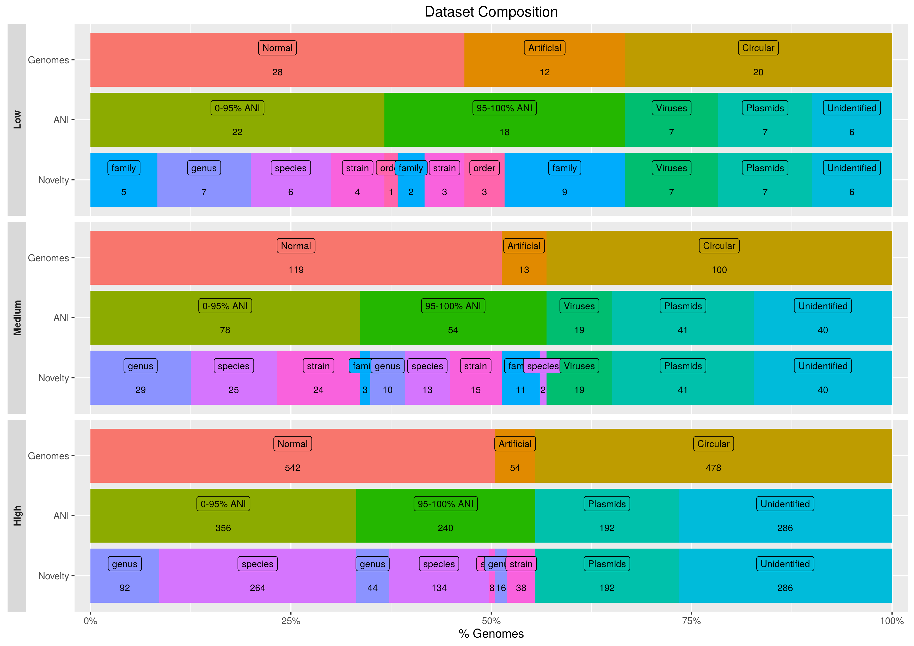

## Dataset composition

*Figure: Dataset composition. The plot visualizes the various types of genomes and their amount within a dataset.
Each bar correlates to the bar(s) above it.
For example, the low complexity dataset has seven genomes of the 'strain' novelty category, 4 below an ANI of 95% and 3 above
but none of them is artificial.*

##taxonomic_profiles
This folder contains the taxonomic profiles of each dataset.
An additional taxonomic profile with the abundance of circular elements removed is also provided.
In addition to a taxonomic profile for each sample of a dataset, there is also a profile for a whole data set.

##Metadata file
Tab separated data table with the annotation of genomes. It is the only file later used for the metagenome simulation.  
Column have no fixed order. First row must have column names.
* genome_ID:  
  Original genome id of a genome or draft genome.
* NCBI_ID:  
  Taxonomic classification. A NCBI taxonomic id.
* [novelty_category](https://github.com/CAMI-challenge/MetagenomeSimulationPipeline/wiki/Novelty-Category):  
Reflects how close a genome seems to be related to known whole genomes in reference databases.  A predicted taxid, based on 16S, is compared with a list of taxids of known whole genomes.
* OTU: Id of genomes that were clustered together ~97% identity.

##novelty_complete.tsv
* Contains a mapping of the novelty cathegory for each genome.
