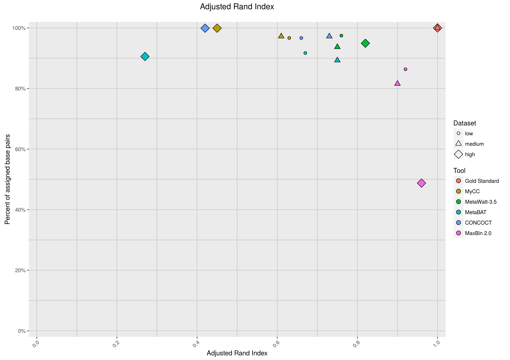
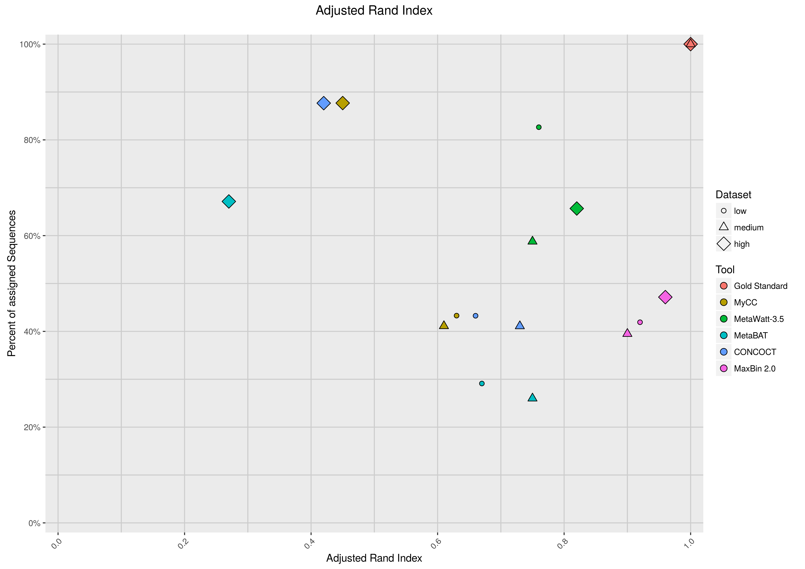
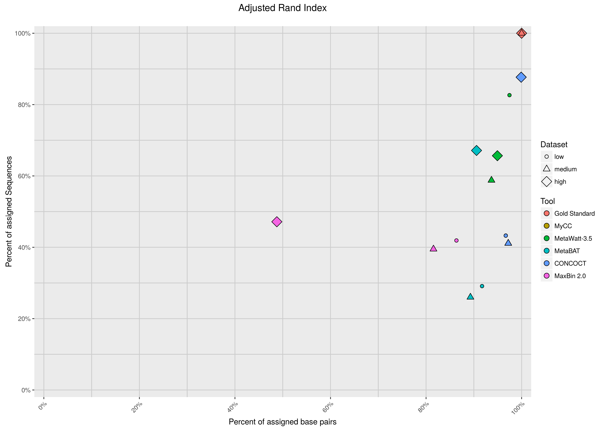

## Dataset composition

*Figure: Dataset composition. The plot visualizes the various types of genomes and their amount within a dataset.
Each bar correlates to the bar(s) above it.
For example, the low complexity dataset has seven genomes of the 'strain' novelty category, 4 below an ANI of 95% and 3 above
but none of them is artificial.*

*Figure: Taxonomic composition of the low complexity dataset.
The plot visualizes the taxonomic profile of a dataset in percent of base pairs.
Names are only shown for classes bigger than 0.5 percent.
The classes are orderd alphabetically and do not relate to the bars above or below them.
Unspecified classes are not (yet) displayed.*

*Figure: Taxonomic composition of the medium complexity dataset.
The plot visualizes the taxonomic profile of a dataset in percent of base pairs.
Names are only shown for classes bigger than 0.5 percent.
The classes are orderd alphabetically and do not relate to the bars above or below them.
Unspecified classes are not (yet) displayed.

*Figure: Taxonomic composition of the high complexity dataset.
The plot visualizes the taxonomic profile of a dataset in percent of base pairs.
Names are only shown for classes bigger than 0.5 percent.
The classes are orderd alphabetically and do not relate to the bars above or below them.
Unspecified classes are not (yet) displayed.*

*Figure: The Adjusted rand index (ARI) on the x-axis is shown in relation to the amound of basepairs in percent on the y-axis.
The ARI was calculated excluding not assigned sequences.
Small genomes with few basepairs have little weight.
A tool not assigning many sequences of small genomes can still look doing rather well.*

*Figure: The Adjusted rand index (ARI) on the x-axis is shown in relation to the amound of sequences in percent on the y-axis.
The ARI was calculated excluding not assigned sequences.
A tool not assigning many sequences, like small genomes, will not look doing well.*

*Figure: A close look at the amount of data that were assigned, independent of whether assigned right or wrong.
The x-axis shows the percent of base pairs that were assigned while the y axis displayst he percent of sequences.
The assembled sequences contain short sequences as well as long ones.
Tools that exclude many sequences could be still assigning a majority of the data, if the sequences excluded are small.*

