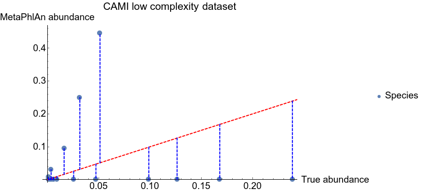

Please see config.yaml
The script is designed to fit the requirements of the web framework of Peter Belman.

## FAQ

**Where can I find the profiling evaluations of the first CAMI challenge, for instance the tables used to generate Supplemetary Figures 23-38 of the [CAMI paper](https://www.nature.com/articles/nmeth.4458)?**

The evaluations are provided on the [CAMI benchmarking portal](https://data.cami-challenge.org/) and on [GitHub](https://github.com/CAMI-challenge/firstchallenge_evaluation). In the latter case, the results for specific tools are in directories with anonymized names in the [submissions_evaluation](https://github.com/CAMI-challenge/firstchallenge_evaluation/tree/master/profiling/data/submissions_evaluation) subdirectory. In each anonymized directory, e.g. 00fda87642a7d7279f31bb65, a description.properties file describes the respective tool and other relevant information like the dataset it was run on.

**Finding evaluations in these anonymized directories is too complicated. How can I sort these results by profiling tools and datasets?**

We recommend that you download or git-clone the results (git clone https://github.com/CAMI-challenge/firstchallenge_evaluation.git) and parse them using e.g. a Python script. As an example, we provide a Python 3 script called [parse_cami1_profiling.py](https://github.com/CAMI-challenge/firstchallenge_evaluation/blob/master/parse_cami1_profiling.py), where you only have to change the variable DIR_PATH to reflect your system path you downloaded the results to. The script outputs the sorted results in directory cami1 inside your working directory.

**I wonder how the gold standard taxonomic assignments were done. For genomes that are not taxonomically classified down to the species rank, it seems that any tool predicting a species annotation for that genome would be penalized by a false positive. To illustrate this with an example: in the LOW1 sample, Bacillales strain 1385.1 is classified in the CAMI data like this:\
`CAMI_taxonomy    2|1239|91061|1385| |     |     |1385.1`\
Would a prediction of the form\
`mOTUs_taxonomy   2|1239|91061|1385| |33986|41170`\
be classified as false positive for the genus and species ranks?**

If a method had a classification at a rank lower than the gold standard, this would be penalized. This was deemed reasonable given there is no way to assess the veracity of a tool's classifying to a lower level when the genome has not been taxonomically classified this far yet. We note that cases such as these are rather rare. For example, in the pooled high complexity data set, only 12.714% of the abundance falls into such a case.

**In the evaluations of the L1 distance (with [OPAL](https://github.com/CAMI-challenge/OPAL)), it seems that OPAL calculates the L1 error on renormalized relative abundances (--no_normalization is False by default). I wonder why the [CAMI format specification](https://github.com/CAMI-challenge/contest_information/blob/master/file_formats/CAMI_TP_specification.mkd) asks not to normalize (“The percentages given for all taxa from the same rank should sum up to <= 100%, that is, if something is unassigned, this will be reflected in a percentage of less than 100% being assigned”). Was this renormalization used for the evaluations in the paper? While I don't see a conceptual reason for doing so, I also noted that it can result in inflated L1 error estimates according to our tests with the mOTU profiler.**

The normalization was performed in the paper, and this is really a choice depending on how you want to interpret the L1 norm. We chose to renormalize since it's more straightforward to compare between samples when all profiles sum up to a fixed abundance value. If each sample is left un-normalized, then the range of L1 norm values varies between them, and it becomes difficult to compare values. As an example, consider the hypothetical situation where, at a particular rank, the ground truth abundance is (.5,.5,0) with different tools predicting abundances of (.5, 0, 0), (.25, .25, 0), (.3, .3, .1), and (.4, .3, .2). Un-normalized, each tool would have the same L1 norm and hence indistinguishable. Normalizing these allows us to tell the difference, and seems to properly account for the varying total abundance estimate.

So the proper interpretation of the normalized L1 norm is: "at a particular rank, does the relative proportion of abundances accurately reflect the relative proportions of the ground truth." This is, of course, a choice to be made, and hence why we allow for the --no_normalization option. No choice will be perfect since we're trying to summarize complex differences with a single number.

**How can Metaphlan2, the overall best-performing tool in Fig. 3A of the CAMI paper (precision equaling 1 at higher taxonomic level), also have an L1 error of 1. In my understanding, the max L1 error (of 1) can only be attained for a completely wrong quantification, i.e. by predicting/quantifying a completely disjoint set of taxa (for which precision cannot be 1).**

Metaphlan2 is great at detecting presence/absence of organisms (though leans heavily in favor of precision over sensitivity), but is otherwise poor at getting the relative abundances correct. For example, here's a plot of the Metaphlan2 results on the low complexity sample at the species level (un-normalized):

Each dot represents a species, either in the gold standard, or the Metaphlan prediction. The red dashed line represents the 45-degree "y=x" line. A perfect prediction would have all blue dots on the red line. The blue dashed lines indicate the terms that go into the L1 norm (so the L1 norm would be the sum of the lengths of the blue lines).

So while Metaphlan has great precision (each of its predictions is indeed in the ground truth), its L1 norm is large for two reasons:
1. The abundance estimates for the true positives is off by a large margin
2. It predicted 0 abundance for many species (false negatives), especially the most abundant ones

The confusion may arise from the fact that Fig. 3A in the CAMI paper is of relative performance in each of those metrics, not the absolute performance (so they could all be visualized on the same figure). Here, Metaphlan at the species level has an L1 norm (normalized) of 1.757, hence its green dashed line on Fig. 3A is 1.757/2. = 87.85% of the way up its spoke. If you took the un-normalized version of L1, this would change to showing the green line 73.3% up the spoke.

Note that in the calculation of 87.85%, we used the correct maximum L1 norm value of 2 (not 1): consider a ground truth of (1,0) and a prediction of (0,1) -> L1 norm = |1-0|+|0-1| = 2.
